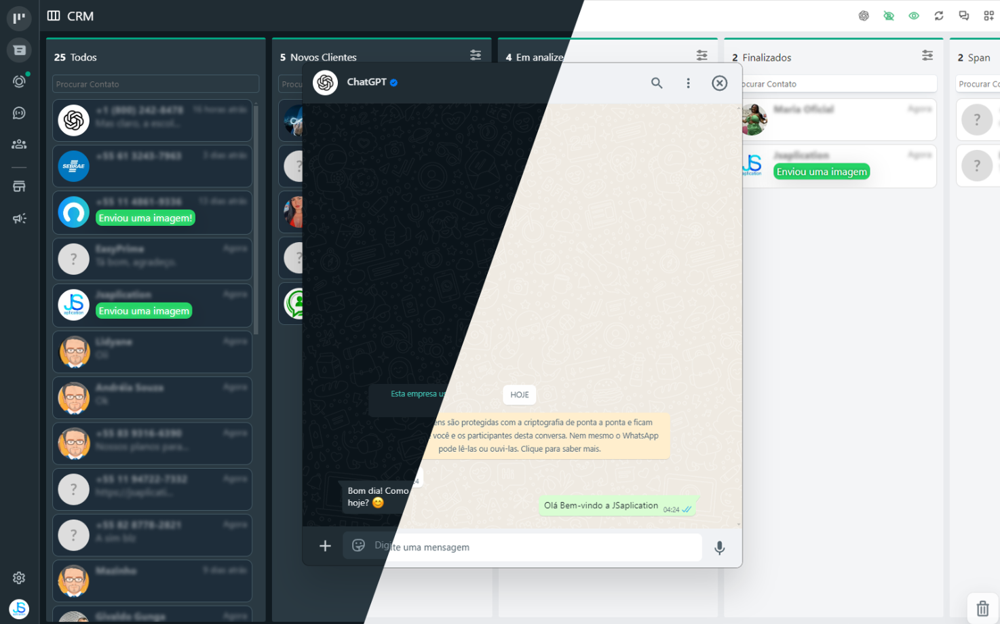

# CRM Kanban para WhatsApp Web
WhatsApp Web CRM Kanban 2025 extension

Transforme seu atendimento com uma poderosa extensão para o **WhatsApp Web**, oferece um **CRM visual estilo Kanban**

---

## 🧩 Funcionalidades

### ✅ CRM Kanban
Gerencie seus contatos com eficiência:
- Visualize seu atendimento com estilo Kanban
- Organize contatos em colunas (estágios personalizados)
- Adicione novas colunas conforme seu processo
- Mais controle, mais agilidade, melhor atendimento
- agendamentos de messagens.
---

### 🧠 Integração com ChatGPT
Converse diretamente com a inteligência artificial:
- Gere respostas rápidas
- Tire dúvidas e crie ideias no fluxo do atendimento
- Automatize tarefas com IA nativa na interface

---

### 🌓 Compatível com temas claro e escuro
Tenha conforto visual e experiência fluida:
- Interface moderna adaptável
- Modo escuro para ambientes noturnos

---

## 📚 Créditos e Bibliotecas Utilizadas

> 📌 O código-fonte desta extensão é uma implementação independente que utiliza essas bibliotecas como base para integração com o WhatsApp Web.

## 💰 Valor do Código Fonte

O código completo da extensão **CRM para WhatsApp Web 2025** está à venda por:

🎯 **R$ 499,99 (pagamento único)**

Você recebe:
- Código 100% funcional e pronto para uso
- CRM estilo Kanban integrado ao WhatsApp Web
- Suporte para instalação inicial
- Codigo todo documentado: facilita melhorias e intedimento do codigo e sua atualização.
- Interface responsiva, com suporte a modo claro/escuro automatico do sistema

🔐 Simples, direto, sem depender de backend.

💡 Ideal para empresas, freelancers, agências ou quem deseja empreender oferecendo atendimento digital com CRM.

📲 Para comprar, fale comigo:
- WhatsApp: [Clique aqui](http://wa.me/+5582981873291)
